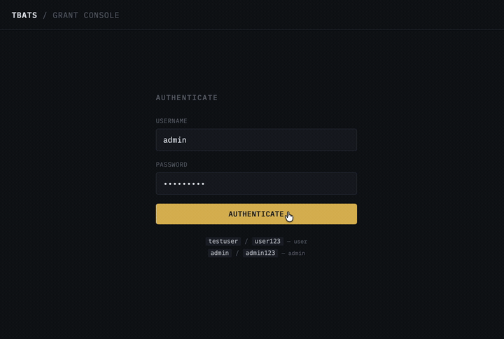

# Time-Bound Access Token Service

[](https://github.com/jcarroll95/time-bound-access-token-service/actions/workflows/ci.yml)
[](https://github.com/jcarroll95/time-bound-access-token-service/actions/workflows/cd.yml)

## Live Demo: [https://api.loadbearing.dev/](https://api.loadbearing.dev/)

Use the test user credentials to log in and create timed access grants.

- **testuser / user123** (USER role)
- **admin / admin123** (ADMIN role)



## Overview

A small but realistic backend service that issues temporary access grants and automatically expires them. This is a  
simplified precursor to a PAM (Privileged Access Management) system, directly rehearsing concepts like authentication,  
authorization, time-bounded permissions, and revocation.

## Objectives

1. REST API design and controllers
2. Persistence with JPA/Hibernate and SQL
3. Authentication via JWT
4. Clear separation of concerns and defined boundaries
5. Testing at every layer

## Core Behavior

- Users request access to a protected resource.
- If approved, the system issues a token valid for a limited duration.
- The system tracks and revokes expired grants.

## Architecture



The service follows a layered Spring Boot architecture where dependencies flow strictly downward: controllers handle HTTP  
translation, services contain all business logic, and repositories manage data access. Authentication is handled as a  
cross-cutting concern via a JWT security filter that runs before any controller logic, decoupling identity verification
from the business layer. See [docs/architecture.md](docs/architecture.md) for a high-level overview.

## API Surface (6 Endpoints)

| Method | Endpoint | Description |
|--------|----------|-------------|
| POST | `/auth/login` | Authenticate and receive a JWT |
| POST | `/grants` | Request a new access grant |
| GET | `/grants/{id}` | Retrieve a specific grant |
| GET | `/grants/active` | List all currently active grants |
| DELETE | `/grants/{id}` | Revoke a specific grant |
| GET | `/health` | Application health check |

See [docs/api-contracts.md](docs/api-contracts.md) for contract definitions.

## Domain Model (3 Entities)

User and AccessGrant are the primary entities. See [docs/entity-relationships.md](docs/entity-relationships.md).

## Tech Stack

**Application**
- Java 21
- Spring Boot 4.0.5
- Spring Security (JWT authentication, BCrypt password hashing)
- Spring Data JPA (Hibernate)
- PostgreSQL
- Flyway (database migrations)
- Bucket4j (token-bucket rate limiting)
- Maven

**Infrastructure & Deployment**
- Docker (multi-stage build)
- AWS ECS Fargate (compute)
- AWS RDS PostgreSQL (managed database)
- AWS ECR (container registry)
- AWS ALB (load balancer, TLS termination)
- AWS ACM (SSL/TLS certificate, auto-renewing)
- AWS Secrets Manager (credential injection)
- GitHub Actions (CI/CD with OIDC authentication to AWS)

## Operational Concerns

- HTTPS with TLS termination at the ALB, HTTP-to-HTTPS redirect via 301
- Rate limiting on authentication and grant creation endpoints (Bucket4j token-bucket)
- Security group chaining: ECS tasks only accept traffic through the ALB, not directly from the internet
- CI pipeline runs tests on every push; CD pipeline builds, pushes to ECR, and deploys to ECS on merge to main
- Environment configuration via `application.yml` profiles (`local`, `demo`)
- Structured logging
- Error handling with consistent JSON error responses
- Database migrations managed by Flyway
- Background job using Spring's `@Scheduled` to periodically revoke expired grants

## Testing Strategy (Integrated From the Start)

- **Repository layer:** `@DataJpaTest` for JPA entity and query validation
- **Service layer:** Unit tests with mocked dependencies
- **Controller layer:** `@WebMvcTest` with MockMvc for endpoint behavior
- **Integration:** `@SpringBootTest` with Testcontainers for full lifecycle and expiration flows against a real PostgreSQL instance

## How to Run Locally

### Setup

Copy `example.env` to `.env` and fill in values:

```bash
cp example.env .env
```

#### Option A: Run app on host machine, Postgres in Docker

Start PostgreSQL:

```bash
docker compose up -d
```

Export environment variables and run the application with the `local` profile
(which loads seeded test users):

```bash
set -a && source .env && set +a
./mvnw spring-boot:run -Dspring-boot.run.profiles=local
```

The service listens on `http://localhost:8080`.

#### Option B: Run app + Postgres both in Docker (recommended for parity)

Use Docker Compose to run both services:

```bash
docker compose up --build
```

The app container uses `DB_HOST=postgres` and `DB_PORT=5432` internally so it can
reach the Postgres service over the Docker network.

#### Option C: Run app image with `docker run` against compose Postgres

If Postgres is started by compose and the app is started separately with `docker run`,
you must attach the app container to the same compose network and use the Postgres
service name on the container port:

```bash
docker compose up -d postgres 
docker run --rm -p 8080:8080 --env-file .env \
  --network tbats_default \
  -e DB_HOST=postgres \
  -e DB_PORT=5432 \
  tbats
```

Why: inside a container, `localhost` points to that same container, not to your Mac
and not to the Postgres container.

### Deployment

The live demo runs on AWS ECS Fargate behind an Application Load Balancer at `api.loadbearing.dev`. The CD pipeline handles deployment automatically on merge to `main`:

1. Tests run against a Testcontainers PostgreSQL instance
2. Docker image is built and pushed to ECR (tagged with commit SHA and `latest`)
3. ECS task definition is updated with the new image
4. ECS service performs a rolling deployment

Required environment variables at deploy time:

- `JWT_SECRET`
- `POSTGRES_DB`
- `POSTGRES_USER`
- `POSTGRES_PASSWORD`
- `DB_HOST` (RDS endpoint)
- `DB_PORT` (usually `5432`)
- `SPRING_PROFILES_ACTIVE` (`demo` for the live instance)

Secrets are stored in AWS Secrets Manager and injected into the ECS task definition. Non-secret environment variables are set directly on the task definition.

> Note: `SPRING_DATASOURCE_USER` is not a Spring Boot datasource property.
> Use `POSTGRES_USER` (as this project does) or `SPRING_DATASOURCE_USERNAME`.

### Example requests

The same API backing the demo site can be called directly: 

Log in as the seeded test user and capture the JWT:

```bash
TOKEN=$(curl -s -X POST https://api.loadbearing.dev/auth/login \
  -H "Content-Type: application/json" \
  -d '{"username":"testuser","password":"user123"}' \
  | jq -r .token)
```

(If you don't have jq installed, just curl POST the credentials and copy the token from the response.)

Create a grant:

```bash
curl -X POST https://api.loadbearing.dev/grants \
  -H "Authorization: Bearer $TOKEN" \
  -H "Content-Type: application/json" \
  -d '{"resourceName":"production-db","durationMinutes":60}'
```

List active grants:

```bash
curl https://api.loadbearing.dev/grants/active \
  -H "Authorization: Bearer $TOKEN"
```

Revoke a grant (use the `id` returned from the create call):

```bash
curl -X DELETE https://api.loadbearing.dev/grants/{id} \
  -H "Authorization: Bearer $TOKEN"
```

For local development, replace `https://api.loadbearing.dev` with `http://localhost:8080`.

### Seeded users

| Username | Password | Role | Available in |
|----------|----------|------|-------------|
| testuser | user123 | USER | `local`, `demo` |
| admin | admin123 | ADMIN | `local`, `demo` |

## Dependency Management

Spring Boot 4.0.5 is the latest patch release at time of writing and includes
current security patches for Spring Framework, Spring Security, Jackson, and
Tomcat. IntelliJ's Package Checker reports no known CVEs against the resolved
dependency tree.

## Bridge to PAM

Once the MVP is achieved, the next project iteration will develop privileged access  
management features including:

- JIT access approvals
- RBAC policies
- Audit logs
- Revocation workflows
- Queue-based revocation